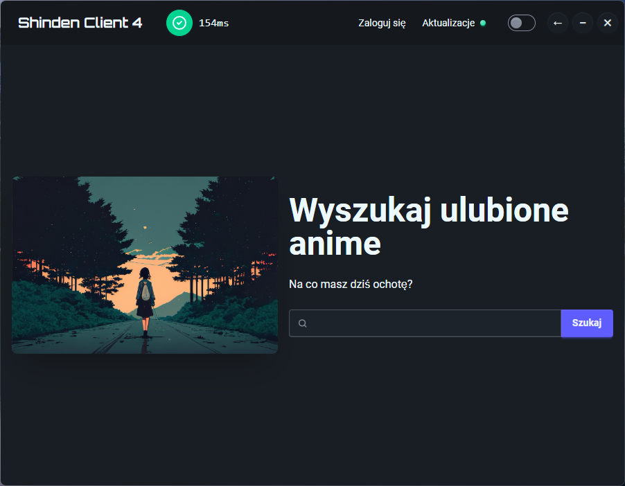
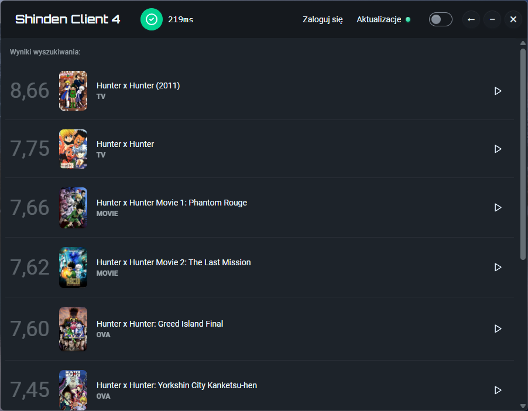
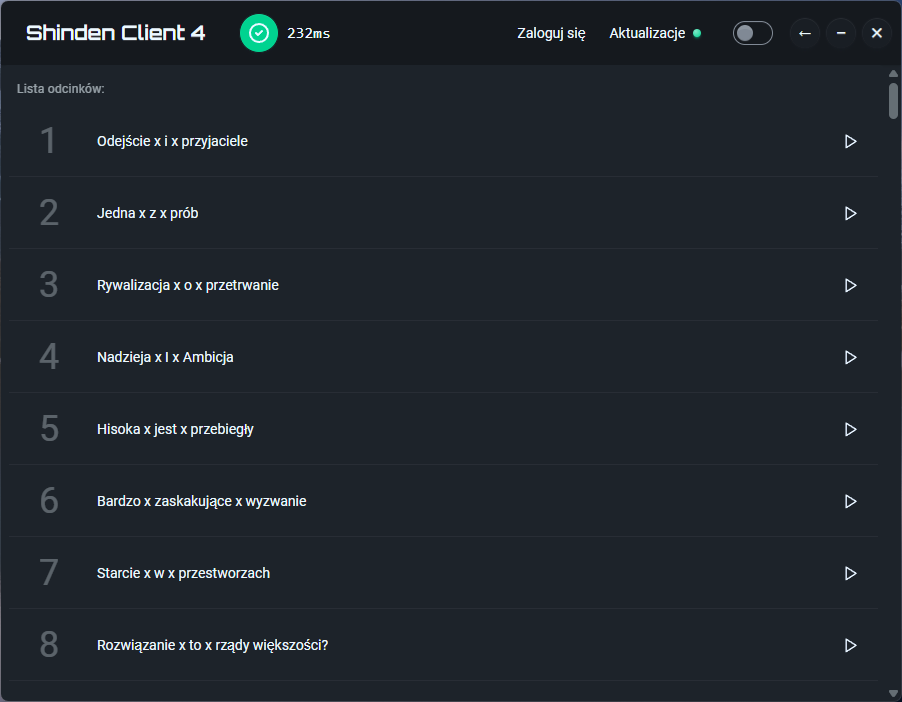
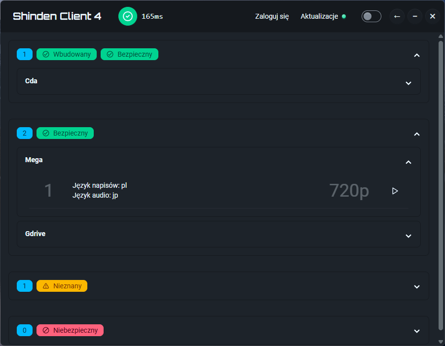
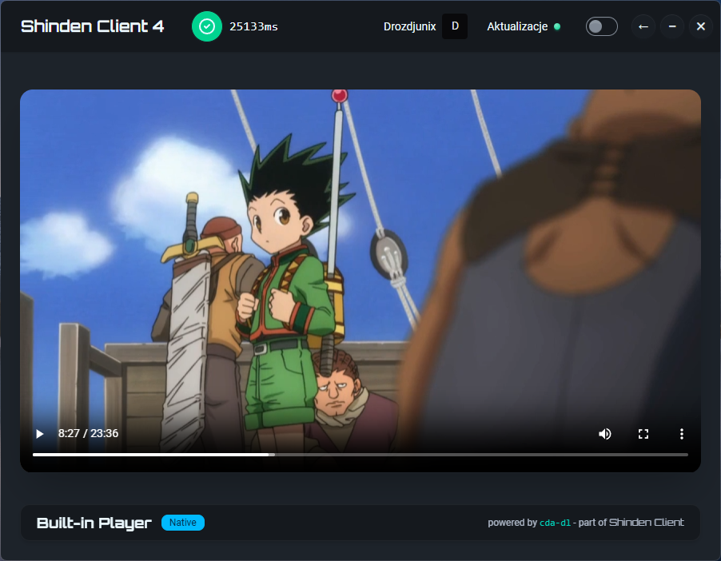

# 🚀 Shinden Client 4

> **Nowoczesna, szybka aplikacja desktopowa dla użytkowników Shinden.pl**  
> Stworzona z pasji do anime — oparta na **Rust + Tauri + SvelteKit**.

---


## 🧩 Co to jest?

**Shinden Client** to natywna aplikacja do przeglądania i oglądania anime na Shinden.pl — bez reklam, śledzenia i zbędnych elementów.
Zamiast przeglądarki, dostajesz lekki, szybki i skoncentrowany na treści interfejs, który po prostu działa.

## 🐍 Eksperymentalny port Python

Repozytorium zawiera teraz wstępny szkic lekkiego launchera w Pythonie. Jest to alternatywna, prosta aplikacja w Tkinterze, która odtwarza podstawowe komendy z warstwy Tauri (wyszukiwanie, logowanie, pobieranie listy odcinków/odtwarzaczy) w trybie mockowym.

### Uruchomienie

1. Zainstaluj zależności Pythona (opcjonalnie `httpx` dla pełnych requestów; fallback działa na wbudowanym `urllib`):

   ```bash
   cd python_app
   python -m venv .venv && source .venv/bin/activate
   pip install -r requirements.txt
   ```

2. Startuj GUI lub tryb CLI:

   ```bash
   # GUI (domyślnie w trybie mock, bez potrzeby konta)
   python -m python_app.launcher

   # Tryb CLI z jednorazowym wyszukiwaniem
   python -m python_app.launcher --cli --search "hunter"
   ```

Kod w `python_app/` jest świadomie izolowany i może być rozwijany niezależnie od wersji Tauri.

## 🌟 Najważniejsze cechy

- ⚡ **Błyskawiczne działanie** – aplikacja startuje w mniej niż sekundę
- 💾 **Niskie zużycie zasobów** – mniej niż 10 MB RAM
- 🧼 **Czysty interfejs bez reklam i popupów**
- 🌗 **Motywy jasny / ciemny**
- 🪵 **Konsola błędów i logów** — pomocna przy zgłoszeniach
- 📺 **Wbudowany odtwarzacz dla treści z cda.pl bez reklam**

---
## 🖥️ Kompatybilność
| System operacyjny | Obsługa |
|-------------------| ------- |
| 🪟 Windows        | ✅ Pełna |
| 🍎 macOS          | ✅ Pełna |
| 🐧 GNU/Linux      | ✅ Pełna |

---

# 🌠 Zrzuty ekranu






---

# LICENCJA

MIT © 2025 Błażej Drozd
This project is not affiliated with Shinden.pl. It does not host or redistribute any copyrighted content.

Projekt nie jest powiązany z Shinden.pl.
Nie hostuje ani nie rozpowszechnia treści objętych prawem autorskim.
Służy wyłącznie jako alternatywny interfejs do istniejącej strony.

# ❤️ Wesprzyj rozwój
- ⭐ Zostaw gwiazdkę, jeśli Ci się podoba
- 🐞 Zgłoś błąd lub otwórz dyskusję
- 🧪 Pomóż testować nowe funkcje
- 🔧 Pull Requesty mile widziane!
